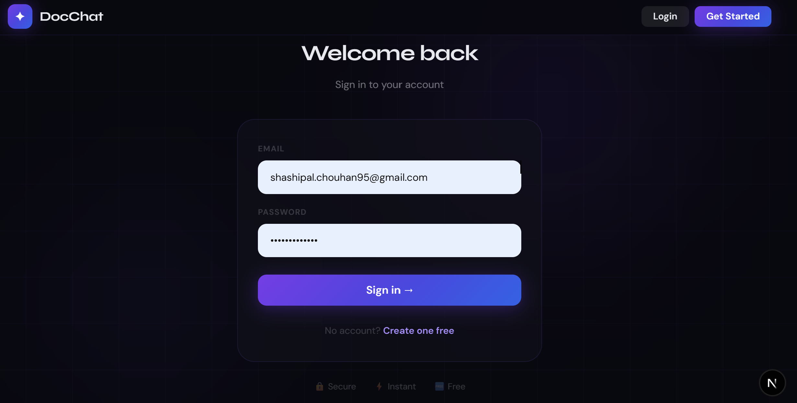
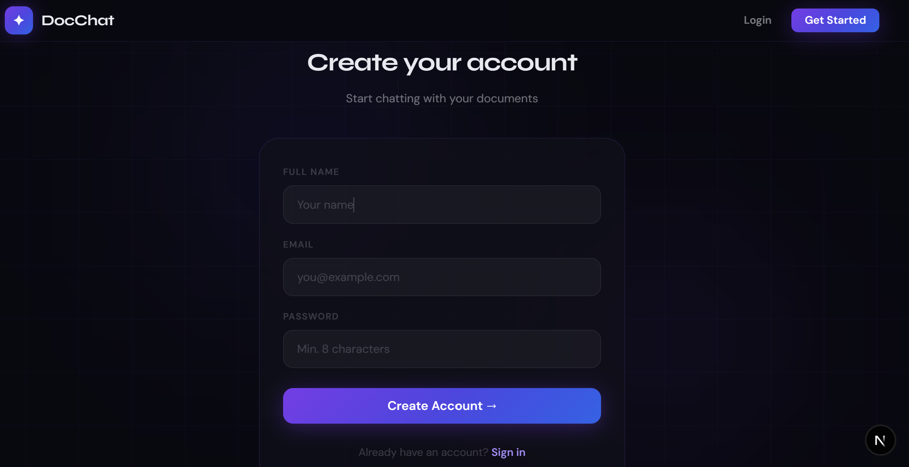

# 🚀 DocRAG – Enterprise RAG Application

A full-stack, Enterprise-grade Multi-Model RAG System with secure user authentication, session management, retrive user conversion history and more. It can understand text , images, pdf; designed for scalable document intelligence and production deployment built with:

- ⚡ Next.js (Frontend)
- 🚀 FastAPI (Backend API)
- 🔐 Supabase Authentication
- 🧠 Gemini, OpenAI,Groq (Qwen3) – LLM Inference Streaming responses
- 🔎 Pinecone – Vector Database
- ✨ Gemini – Embeddings 

---

## 🌟 Features

- 🔐 Secure Authentication (Supabase JWT)
- 📄 Upload and chat with PDFs
- 🔍 Semantic search using Pinecone
- 🧠 Fast LLM responses via Groq
- 📦 Production-ready FastAPI structure
- 🧪 Unit tested backend
---

## 🏗 Architecture


## 📸 Project Screenshots

### 🏠 Landing Page


### 🔐 Login Page


### 📝 Sign Up Page


### 💬 Chat Interface


---

## 🔐 Authentication Flow

1. User logs in via Supabase
2. Supabase returns JWT
3. Frontend sends JWT to FastAPI
4. Backend validates token
5. Protected endpoints allow access

---

## ⚡ RAG Flow

1. User submits query
2. Query embedded via Gemini
3. Pinecone retrieves top-k documents
4. Context sent to Groq LLM
5. LLM generates response
6. Response returned to frontend

---

## 🛠 Setup Instructions

### 1️⃣ Clone Repo

```bash
git clone https://github.com/shashipal95/Doc-RAG.git
cd Doc-RAG


cd backend
python -m venv .venv
source .venv/bin/activate  # Windows: .venv\Scripts\activate
pip install -r requirements.txt

uvicorn app.main:app --reload

```

3️⃣ Frontend Setup
```bash
cd frontend
npm install
npm run dev

http://localhost:3000
```

🧪 Running Tests
```bash
cd backend
pytest
```


promptfoo.cmd eval

promptfoo.cmd view

promptfoo share


cloudflared tunnel --url http://localhost:11434


cloudflared tunnel --url http://localhost:11434 --http-host-header localhost


Groq - LLama 3.3 70B model

Gemini 2.5 flash

OpenAI - GPT-4o Mini

Ollama - llama 3.2:3b